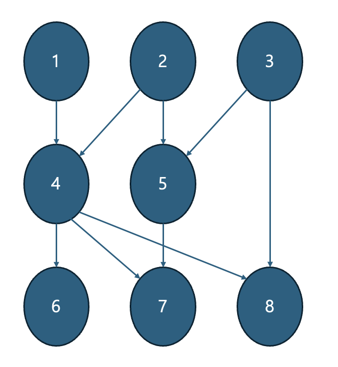

# Topological sorting (위상 정렬)

---
- 유향 그래프(방향이 있는 그래프)의 꼭짓점들을 변의 방향을 거스르지 않도록 나열하는 것
- 대학의 선수과목 구조를 예로 들 수 있음
- 선후 관계가 정의된 그래프 구조 상에서 사용
- 위상 정렬 성립 조건: 비순환 유향 그래프(directed acyclic graph)

## Alogrithm
### Kahn의 알고리즘
- 처음으로 시작 노드를 찾음
- 꼭짓점과 연결되지 않고, S집합에 연결되어 있는 적어도 하나의 노드는 비어있지 않은 순환 그래프 안에 존재
``` python
# L: Empty list that will contain the sorted elements
# S: Set of all nodes with no incoming edge

while S is not empty do
    remove a node n from S
    add n to L
    for each node m with an edge e from n to m
        remove edge e from the graph
        if m has no other incoming edges then
            insert m into S
if graph has edges then
    return error # graph has at least one cycle
else
    return L # a topologically sorted order
```
### code
- 시간복잡도: O(V+E)
```python
from collections import deque

v, e = map(int, input().split())

indegree = [0] * (v+1)              # 노드의 차수 정보
graph = [[] for _ in range(v+1)]    # 노드 간 연결된 노드 정보

for _ in range(e):
    a, b = map(int, input().split())    # 간선 정보
    graph[a].append(b)                  # a 노드에 b 노드 연결
    indegree[b] += 1                    # b 노드의 차수 +1

def topologyical_sorting():     # 위상 정렬
    result = []
    q = deque()

    for i in range(1, v+1):
        if indegree[i] == 0:    # 노드의 차수가 0 = 연결된 노드가 없음
            q.append(i)         # 큐에 추가

    while q:
        now = q.popleft()
        result.append(now)
        for i in graph[now]:    # now node에 연결된 노드 하나씩 출력
            indegree[i] -= 1    # 노드 연결 제거
            if indegree[i] == 0:    # 만약 연결된 노드가 없다면, 큐에 추가
                q.append(i)

    for i in result:
        print(i, end=" ")

topologyical_sorting()
```
### example

- v = 8, e = 9
- 간선(edge) 정보
```python
1 4
2 4
2 5
3 5
3 8
4 6
4 7
4 8
5 7
```
- result: 1 2 3 4 5 6 8 7 
